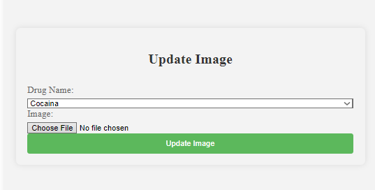

<!DOCTYPE html>
<html lang="ro">
<head>
    <meta charset="UTF-8">
</head>
<body>
<article>
    <header>
        <h1>
            RoDX (Romanian Drug Explorer)
        </h1>
    </header>
    <h2>Cuprins</h2>
 <ul>
        <li>
            <a href="#authors">Autori</a>
        </li>
        <li>
            <a href="#introduction">1. Introducere</a>
            <ul>
                <li><a href="#introduction-purpose">1.1 Scop</a></li>
                <li><a href="#conventions">1.2 Convenție de scriere</a></li>
                <li><a href="#audience">1.3 Publicul țintă</a></li>
                <li><a href="#product-scope">1.4 Scopul produsului</a></li>
                <li><a href="#references">1.5 Referințe</a></li>
            </ul>
        </li>
        <li><a href="#overall">2. Descriere Generală</a>
            <ul>
                <li><a href="#product-perspective">2.1 Perspectiva produsului</a></li>
                <li><a href="#product-functions">2.2 Funcțiile produsului</a></li>
                <li><a href="#documentation">2.3 Documentația pentru utilizator</a></li>
            </ul>
        </li>
          <li><a href="#external">3. Interfețele aplicației </a>
            <ul>
                <li><a href="#user-interface">3.1 Interfața utilizatorului </a>
                    <ul>
                        <li><a href="#nav-bar">3.1.1 Bara de navigație </a></li>
                        <li><a href="#admin">3.1.2 Interfata cu baza de date </a></li>
                        <li><a href="#home-page">3.1.3 Pagina de acasă </a></li>
                        <li><a href="#error400">3.1.4 Pagina 400 </a></li>
                        <li><a href="#error404">3.1.5 Pagina 404 </a></li>
                        <li><a href="#element">3.1.6 Pagina fiecarui element</a></li>
                        <li><a href="#campings">3.1.7 Pagina campaniilor</a></li>
                        <li><a href="#help">3.1.8 Pagina de ajutor </a></li>
                        <li><a href="#about">3.1.9 Pagina informativa </a></li>
                    </ul>
                </li>
                <li><a href="#hardware-interface">3.2 Interfața Hardware </a></li>
                <li><a href="#software-interface">3.3 Interfața Software</a></li>
                <li><a href="#communication-interface">3.4 Interfața de comunicare</a></li>
            </ul>
        </li>
        <li><a href="#system-features">4. Caracteristici ale sistemului</a>
            <ul>
                <li><a href="#utilizatori">4.1 Secțiunea Utilizatori</a>
                    <ul>
                        <li><a href="#utilizatori-1">4.1.1 Descriere și generalități</a></li>
                        <li><a href="#utilizatori-2">4.1.2 Actualizarea informațiilor</a></li>
                        <li><a href="#utilizatori-3">4.1.3 Condiții de funcționare</a></li>
                    </ul>
                </li>
                <li><a href="#administrator">4.2 Secțiunea Admin</a>
                    <ul>
                        <li><a href="#administrator-1">4.2.1 Descriere și generalități</a></li>
                        <li><a href="#administrator-2">4.2.2 Actualizarea informațiilor</a></li>
                        <li><a href="#administrator-3">4.2.3 Condiții de funcționare</a></li>
                    </ul>
                </li>
                <li><a href="#other">4.3 Alte funcționalități </a>
                    <ul>
                        <li><a href="#other-1">4.3.1 Descriere și generalități</a></li>
                        <li><a href="#other-2">4.3.2 Actualizarea informațiilor</a></li>
                        <li><a href="#other-3">4.3.3 Condiții de funcționare</a></li>
                    </ul>
                </li>
                <li><a href="#non-functional">5.Funcționalități pentru protecție și securitate</a>
                      <ul>
                         <li><a href="#safety">5.1 Protecția datelor</a></li>
                         <li><a href="#security">5.2 Securizarea datelor</a></li>
                         <li><a href="#software-attributes">5.3 Calitățile Software </a></li>
                      </ul>
                </li>
            </ul>
        </li>
    </ul>
    

        <section id="authors" typeof="sa:AuthorsList">
            <h2>Autori</h2>
            <ul>
                <li property="schema:author" typeof="sa:ContributorRole">
            
              <meta content="Ionuț" property="schema:givenName">
              <meta content="Mihai" property="schema:additionalName">
              <meta content="Simioniuc" property="schema:familyName">
              Simioniuc Ionut-Mihai
            
                    <ul>
                        <li property="schema:roleContactPoint" typeof="schema:ContactPoint">
                            <a href="mailto:simioniucionut1@gmail.com" property="schema:email">simioniucionut1@gmail.com</a>
                        </li>
                    </ul>
                </li>
                <li property="schema:author" typeof="sa:ContributorRole">
            
              <meta content="Ștefan" property="schema:givenName">
              <meta content="" property="schema:additionalName">
              <meta content="Huțan" property="schema:familyName">
              Huțan Ștefan
            
                    <ul>
                        <li property="schema:roleContactPoint" typeof="schema:ContactPoint">
                            <a href="mailto:hutanstefan@gmail.com" property="schema:email">hutanstefan@gmail.com</a>
                        </li>
                    </ul>
            </ul>
        </section>
    

      <section id="introduction">
        <h3>1. Introducere</h3>
        <section id="introduction-purpose">
            <h4>1.1 Scop</h4>
            

                RoDX (Romanian Drug Explorer) este o aplicație web dezvoltată de studenții menționați în secțiunea
                de Autori de la Facultatea de
                Informatică a Universității Alexandru Ioan Cuza.
                Scopul acestui document este acela de a prezenta o descriere detaliată a funcționalităților, precum și
                de a 
                specifica cerințele aplicației web. Această aplicație
                va oferi tuturor utilizatorilor posibilitatea de a se informa in legătură cu situația drogurilor din 
                România, utilizatorul are posibilitatea de a genera fișierul cu datele din anumiti ani, selectați de 
                utilizator, în format HTML și CSV.
            

        </section>
        <section id="conventions">
            <h4> 1.2 Convenția documentului</h4>
            <ul>
                <li>
                    Acest document urmează șablonul de documentație a cerințelor software conform IEEE Software
                    Requirements
                    Specification.
                </li>
                <li>
                    Textul <b>îngroșat</b> este folosit pentru a defini noțiuni personalizate sau pentru a accentua
                    concepte
                    importante.
                </li>
            </ul>
        </section>
        <section id="audience">
            <h4>1.3 Publicul țintă</h4>
            

               Acest document este destinat oricărui tip de utilizator interesat de situația drogurilor din România, precum 
               și persoanelor interesate de campaniile anti-drog și de dorința de informare științifică a efectului sau a 
               consumului unei anumite substanțe, precum și a consecințelor legale.
            

        </section>
        <section id="product-scope">
            <h4>1.4 Scopul Produsului</h4>
            

                Scopul aplicației este acela de a oferi utilizatorilor un soft atât educațional cât și analitic. 
                Utilizatorul poate filtra în funcție de anumite tipuri despre ce drog dorește să caute informații și 
                poate genera grafice care expun date despre consum sau infracționalitate într-o anumită perioadă de timp. 
                Utilizatorul mai poate extrage documente în format HTML și CSV cu date analiste referitoare la drogul respectiv.
            

        </section>
          <section id="references">
            <h4>1.5 Bibliografie</h4>
            <ul>
                <li>Daniel Isepciuc, Site-ul Tehnologii Web, FII UAIC</li>
            </ul>
        </section>
      </section>
        <section id="overall">
        <h3>2. Descriere Generală</h3>
        <section id="product-perspective">
            <h4>2.1 Perspectiva produsului</h4>
            
 RoDX (Romanian Drug Explorer) este o aplicație dezvoltată în cadrul cursului de Tehnologii Web,
                menită să ofere un mod de informare și analiză a datelor referitoare la consumul de droguri din România.
        </section>
         <section id="product-functions">
            <h4>2.2 Funcționalitățile produsului</h4>
            Fiecare utilizator va avea acces la urmatoarele funcționălități:
            <ul>
                <li>să consulte pagină "Home" unde va putea selecta unul din drogurile disponibile pe site.</li>
                <li>să consulte pagină unui drog unde va putea filtra si descarca date despre acesta.</li>
                <li>să acceseze pagina "Campagnis" pentru a accesa pagia cu campaniile anti-drog in ultimii ani, avand posibilitatea de a descarca si filtra date despre acestea.</li>
                <li>să acceseze pagina "Infractionalitate" pentru a accesa pagia cu infractionalitati, avand posibilitatea de a descarca si filtra date despre acestea.</li>
                <li>să acceseze pagina "Urgente Medicale" pentru a accesa pagia cu urgente medicale, avand posibilitatea de a descarca si filtra date despre acestea.</li>
                <li>să acceseze pagina "About" pentru a accesa scurtă descriere a paginii web</li>
                <li>să acceseze pagina "Contact Us" pentru a putea trimite un email de in caz ca utilizatorul are nevoie de ceva.</li>
                <li>dacă utilizatorul are rol de <b>admin</b>, acesta poate elimina date din baza de date</li>
                <li>dacă utilizatorul are rol de <b>admin</b>, acesta poate adăuga noi droguri ,cu imagini descriere si tipul acestora in baza de date</li>
                <li>dacă utilizatorul are rol de <b>admin</b>, acesta poate modifica/actualiza anumite informatii din baza de date</li>
                <li>dacă utilizatorul are rol de <b>admin</b>, acesta poate adauga fisiere csv iar cu ajutorul lor sunt adaugate date din baza de date</li>
            </ul>
        </section>
          <section id="users">
            <h4>2.3 Clase și caracteristici ale utilizatorilor</h4>
            <h5>2.3.1 Utilizator principal</h5>
            <ul>
                    <ul>
                        <li>orice categorie de oameni care doresc sa se informeze si sa caute date si informatii despre un anumit
                            drog si care doresc sa vizualizeze grafice,tabele,mape.
                        </li>
                    </ul>
                <li>
                    adminul:
                    <ul>
                        <li>poate sa modifice/actualizeze date de pe site referitoare la anumite tipuri de droguri. Poate sa adauge
                            sau sa stearga anumite produse.
                        </li>
                    </ul>
                </li>
            </ul>
            <h5>2.3.2 Caracteristici</h5>
            <ul>
                <li>Utilizatorii care deschid pagina nu au nevoie de logare pt a putea interactiona cu pagina.
                    Odata intrati pe pagina pot naviga printre diferitele tipuri de droguri si pot vizualiza pe pagina
                    graficele referitoare la consumul de droguri intr o anumita perioada de timp.Acestia mai au si posibilitatea 
                    de a genera fisiere analiste referitoare la drogul respectiv.
                </li>
            </ul>
        </section>
          <section id="operating-environment">
            <h4>2.4 Mediul de operare</h4>
            

                Produsul dezvoltat poate fi utilizat pe orice dispozitiv cu un browser web care suportă HTML5, CSS și
                JavaScript.
            

        </section> 
         <section id="documentation">
            <h4>2.5 Documentația pentru utilizator</h4>
            

                Utilizatorii pot consulta acest document pentru explicații detaliate despre funcționalitățile aplicației
                web.
            

        </section>
    </section>
    <section id="external">
        <h3>3. Interfețele aplicației</h3>
        <section id="user-interface">
            <h4>3.1 Interfața utilizatorului</h4>
            Mai jos, puteți vedea o prezentare generală a fiecărei pagini a aplicației și funcționalităților pe care le
            oferă:
            <ul>
                <li id="nav-bar"><b>Bara de navigație</b></li>
                <li style="list-style: none">
                    <ul>
                        <li>Aceasta reprezintă meniul de navigare către fiecare pagina a aplicației, prezent pe fiecare
                            pagină totodată.
                        </li>
                        <li class="pictures" style="list-style: none"></li>
                        <li>Bara de navigare fiind si responsive,la o rezolutie mica aceasta se schimba.
                        </li>
                       <li class="pictures" style="list-style: none"></li>
                    </ul>
                </li>
                <li id="home-page"><b> Pagina de acasă</b></li>
                <li style="list-style: none">
                    <ul>
                        <li>Pagina are rolul de a prezenta diferitele tipuri de droguri intr un format scrolabil si prietenos cu utilizatorul</li>
                        <li class="pictures" style="list-style: none">
                        </li>
                    </ul>
                </li>
                 <li id="about-page"><b> Pagina about</b></li>
                <li style="list-style: none">
                    <ul>
                   <li>Aceasta pagina prezinta o descriere generala a produsului web.
                   </li>
                    <li class="pictures" style="list-style: none">
                        </li>
                    </ul>
                </li>
                 <li id="help-page"><b> Pagina de ajutor</b></li>
                <li style="list-style: none">
                    <ul>
                    <li>Aceasta pagina prezinta un form ce poate fi trimis catre ownerul serverului in caz ca utilizatorul are nevoie de ceva si de aici adminul se poate conecta.
                   </li>
                   <li class="pictures" style="list-style: none">
                        </li>
                    </ul>
                </li> 
                 <li id="element-page"><b> Pagina specifica fiecarui drog</b></li>
                <li style="list-style: none">
                    <ul>
                    <li>Aceasta pagina prezinta imagini , tipul si descrierea drogului respectiv.
                   </li>
                    <li class="pictures" style="list-style: none">
                   </li>
                    </ul>
                     <ul>
                    <li> Utilizatorul poate selecta ce fel de modalitate sa vada datele.
                    </li>
                     <li class="pictures" style="list-style: none">
                        </li>
                    </ul>
                    <ul>
                    <li> Pot fi modificate datele graficul in functie de anul selectat.
                    </li>
                     <li class="pictures" style="list-style: none">
                        </li>
                    </ul>
                    <ul>
                    <li> Sub grafic utilizatorul poate exporta datele din acesta in format png si svg.
                    </li>
                     <li class="pictures" style="list-style: none">
                        </li>
                    </ul>
                    <ul>
                    <li> Tabelul poate fi sortat crescator si descrescator in functie de ce coloana alege utilizatorul, acesta avand posibilitatea de a fi exportat.
                    </li>
                     <li class="pictures" style="list-style: none">
                        </li>
                    </ul>
                    <ul>
                    <li> Harta filtreaza date in functie de judete, ce pot fi exportate, in functie de anul selectat.
                    </li>
                     <li class="pictures" style="list-style: none">
                        </li>
                    </ul>
                    <ul>
                    <li> Butonul de "Export All" exporta toate datele din graf/tabel/harta in format CSV.
                    </li>
                     <li class="pictures" style="list-style: none">
                        </li>
                    </ul>
                </li> 
                <li id="urgente-page"><b> Pagina specifica urgentelor medicale</b></li>
                <li style="list-style: none">
                <ul>
                    <li>Aceasta pagina prezinta date despre urgente medicale, unde de asemenea cuprinde date ce pot fi exportate de utilizator.
                   </li>
                    <li class="pictures" style="list-style: none">
                   </li>
                    <li class="pictures" style="list-style: none">
                   </li>
                    <li class="pictures" style="list-style: none">
                   </li>
                    <li class="pictures" style="list-style: none">
                   </li>
                    </ul>
                </li> 
                 <li id="=inf-page"><b> Pagina specifica urgentelor medicale</b></li>
                <li style="list-style: none">
                <ul>
                    <li>Aceasta pagina prezinta date despre infractionalitati, unde de asemenea cuprinde date ce pot fi exportate de utilizator.
                   </li>
                    <li class="pictures" style="list-style: none">
                   </li>
                    <li class="pictures" style="list-style: none">
                   </li>
                    <li class="pictures" style="list-style: none">
                   </li>
                    <li class="pictures" style="list-style: none">
                   </li>
                    </ul>
                </li> 
                 <li id="campings-page"><b> Pagina specifica campaniilor anti-drog</b></li>
                <li style="list-style: none">
                 <ul>
                    <li>Aceasta pagina prezinta date despre campanii anti-drog, unde de asemenea cuprinde date ce pot fi exportate de utilizator.
                   </li>
                    <li class="pictures" style="list-style: none">
                   </li>
                    <li class="pictures" style="list-style: none">
                   </li>
                    <li class="pictures" style="list-style: none">
                   </li>
                    <li class="pictures" style="list-style: none">
                   </li>
                    <li class="pictures" style="list-style: none">
                   </li>
                    </ul>
                 </li> 
        </ul>
        <section id="hardware-interface">
                <h4>3.2 Interfața Hardware</h4>
                

                    Acest produs nu necesită interfețe hardware, funcționând pe orice platformă (calculatoare,
                    laptopuri,
                    telefoane etc.), care are instalată un browser.
                

            </section>
             <section id="software-interface">
                <h4>3.3 Interfața Software</h4>
                

                    Cerințele minime de software includ un browser funcțional, compatibil cu HTML5 și cu JavaScript.
                <h5>Postgres Database</h5>
                Aceasta reprezintă baza de date în care stocăm informații despre fiecare drog ,descrierea ,tipul,imaginile
                si alte date analiste.
            </section>
             <section id="communication-interface">
                <h4>3.4 Interfața de comunicare</h4>
                

                    Aplicația necesită o conexiune la internet. Standardul de comunicare care va fi utilizat este HTTP.
                

            </section>
            <section id="system-features">
                <h3>4. Caracteristici ale sistemului</h3>
                <section id="management">
                    <h5 id="management-2">4.1.1 Actualizarea informațiilor</h5>
                    <ul>
                        <li>  
                            Atunci cand administratorul decide ,acesta poate interactiona cu baza de date a paginii si o poate modifica.
                            Poate adauga noi tipuri de droguri,noi date sau le poate actualiza pe cele vechi.
                        </li>
                    </ul>
                </section>
                 <section id="utilizatori">
                    <h4>4.2 Secțiunea de utilizatori</h4>
                    <h5 id="utilizatori-1">4.2.1 Descriere și generalități</h5>
                    
 Pe site utilizatorul poate naviga printre diferitele tipuri de droguri sau poate vizualiza alte 3 tipuri de pagini referitoare la droguri

                    <h5 id="utilizatori-2">4.2.2 Actualizarea informațiilor</h5>
                    <ul>
                        <li>
                        Informatiile sunt actualizate in functie de preferintele utilizatorului, acestea pot fi vizualizate in 3 moduri: graf, tabel si harta, datele fiind filtrate in 3 moduri diferite.
                        </li>
                    </ul>
                    <h5 id="utilizatori-3">4.2.3 Condiții de funcționare</h5>
                    <ul>
                        <li>
                            Utilizatorul nu trebuie să fie autentificat.
                        </li>
                        <li>
                            Utilizatorul trebuie să fie adminul.
                        </li>
                    </ul>
                </section>
                 <section id="administrator">
                    <h4>4.3 Secțiunea Admin</h4>
                    <ul>
                        <li> Pentru a putea accesa partea de admin, ai nevoie de un cont de admin<li>
                        <li class="pictures" style="list-style: none"></li>
                        <li> User/Pass se afla in baza de date, parola fiind Hashed<li>
                        <li class="pictures" style="list-style: none"></li>
                    </ul>
                    <h5 id="administrator-1">4.3.1 Descriere și generalități</h5>
                    Secțiunea <b>Admin</b> este destinată dezvoltatorilor paginii <b>administrator</b> și
                    această
                    oferă facilități pe care un utilizator normal nu le are. În momentul în care adminul accesează
                    panoul de control,
                    va putea adauga/modifica anumite tipuri de droguri. Totodată, acesta este
                    capabil să șteargă
                    anumite tipuri de droguri.
                    

                    <h5 id="administrator-2">4.3.2 Actualizare informațiilor</h5>
                    <ul>
                        <li>
                            În momentul în care adminul adaugă un drog, informațiile despre
                            acesta sunt inserate
                            în baza de
                            date.
                        </li>
                        <li class="pictures" style="list-style: none"></li>
                        <li>
                            Adminul poate selecta un drog existent din baza de date, iar informațiile despre
                            acestea sunt
                            actualizate în baza de
                            date.
                        </li>
                        <li class="pictures" style="list-style: none"></li>
                        <li class="pictures" style="list-style: none"></li>
                        <li class="pictures" style="list-style: none"></li>
                        <li class="pictures" style="list-style: none"></li>
                        <li>
                            Adminul poate selecta un drog existent din baza de date si sa-l stearga, iar informațiile despre
                            acestea sunt
                            sterse din baza de
                            date.
                        </li>
                        <li class="pictures" style="list-style: none"></li>
                        <li>
                            Adminul poate incarca fisiere CSV, iar aceste date
                            ajuta la popularea bazei de date.
                        </li>
                        <li class="pictures" style="list-style: none"></li>
                         <li>
                            Adminul poate genera date despre droguri din CSV-urile respective selectand un anul dorit. 
                        </li>
                        <li class="pictures" style="list-style: none"></li>
                         <li>
                            Adminul poate genera Jsonuri cu date din anul respectiv, acestea fiind luate din baza de date.
                        </li>
                        <li class="pictures" style="list-style: none"></li>
                        <li>
                            Adminul poate creea conturi de admin.
                        </li>
                        <li class="pictures" style="list-style: none"></li>
                         <li>
                            Adminul se poate deloga de la cont sau intoarce pe pagina principala, acesta pastrandu-si datele de la login cu ajutorul sesiunii.
                        </li>
                        <li class="pictures" style="list-style: none"></li>
                    </ul>
                    <h5 id="administrator-3">4.3.3 Condiții de funcționare</h5>
                    <ul>
                        <li>
                            Aceste drepturi sunt permise doar perosanelor care detin server-ul.
                        </li>
                        <li>
                            Utilizatorul care nu detine controlul asupra paginii nu va putea modifica nimic.
                        </li>
                    </ul>
                </section>
                 <section id="other">
                    <h4>4.5 Alte funcționalități</h4>
                    <h5 id="other-1">4.5.1 Descriere și generalități</h5>
                    <h5 id="other-2">4.5.2 Actualizarea informațiilor</h5>
                    <ol>
                        <li>
                        </li>
                    </ol>
                    <h5 id="other-3">4.5.3 Cerințe de funcționare</h5>
                    <ul>
                        <li>
                        </li>
                    </ul>
                </section>
            </section>
            <section id="non-functional">
                <h3>5. Funcționalități pentru protecție și securitate</h3>
                <section id="safety">
                    <h4>5.1 Protecția datelor</h4>
                    

                        Aplicația va asigura confidențialitatea datelor prin intermediul unei criptări.
                        Parolele conturilor de admin sunt hashuite ,astfel pastranduse securitatea si protectia parolei respective.
                    

                </section>
                <section id="security">
                    <h4>5.2 Securizarea datelor</h4>
                    

                        Aplicatia este securizata impotriva atacurilor de tip SQL Injection . S-au folosit diferite mecanimse de securizare
                        precum prepareStmt sau (alt mecanims).
                    

                </section>
                <section id="software-attributes">
                    <h4>5.3 Calitățile Software</h4>
                    <ul>
                        <li>Adaptabilitate</li>
                        <li>Ușurință în utilizare</li>
                        <li>Flexibilitate</li>
                        <li>Mobilitate</li>
                        <li>Securitate</li>
                    </ul>
                </section>
        </section>
    </section>
</section>
</article>
</body>
</html>
